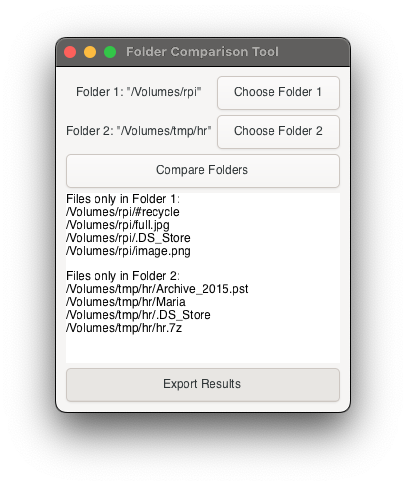

# Comparust

Rust application that compares two folders:

## Application Requirements

### 1. User Interface:

- A graphical user interface (GUI) using the ggez library.
- Support for drag-and-drop functionality to specify folder paths.
- Keyboard shortcuts for specific actions:
- S: Swap the two folders.
- 1: Show only the results from Folder 1.
- 2: Show only the results from Folder 2.
- Display instructions for the user at the top of the window.

### 2. Folder Comparison Logic:

- Ability to read the contents of two specified folders.
- Display differences between the two folders:
- List files that are only present in Folder 1.
- List files that are only present in Folder 2.
- Ignore .DS_Store files in comparisons (optional).
- Option for recursive comparison of folder contents (optional).

### 3. Output Display:

- Display results in a scrollable area below the instruction text.
- Each result should be displayed on a separate line.
- Results should be color-coded:
- Results from Folder 1 are displayed in blue.
- Results from Folder 2 are displayed in green.
- General output is displayed in white.
- Clear visual separation (border) between instruction text and results.

### 4. User Interaction:

- Allow users to dynamically filter displayed results without restarting the application.
- Results should remain visible after exporting to prevent loss of context.
- Implement a way to export or save the comparison results (optional).

### 5. Error Handling:

- Graceful handling of errors when reading folders (e.g., access denied, non-existent folders).
- User feedback in the GUI for any errors encountered during folder operations.

### 6. Performance:

- Efficient comparison of folder contents, especially for large directories.

## Technical Requirements

- Use the ggez library for creating the GUI.
- Use standard Rust features and libraries for file handling and comparisons.
- Ensure compatibility with macOS.
